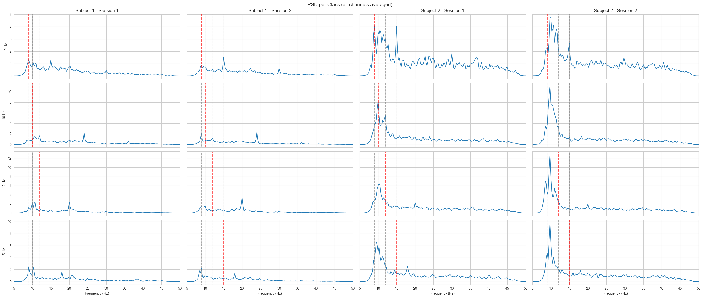
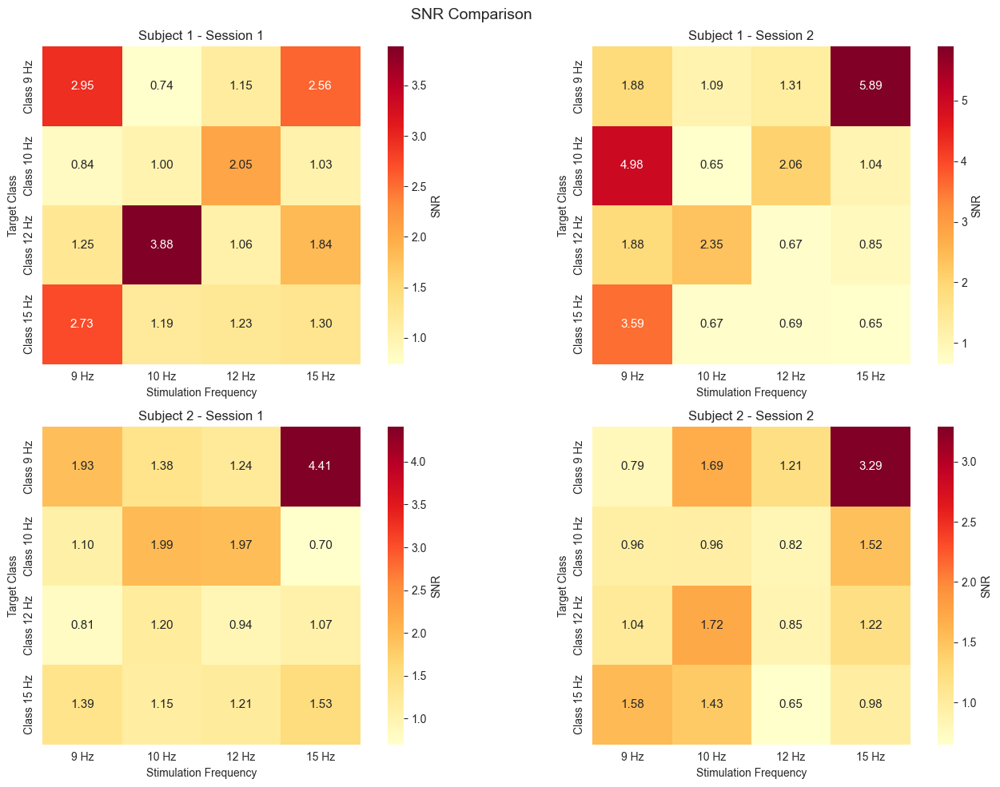
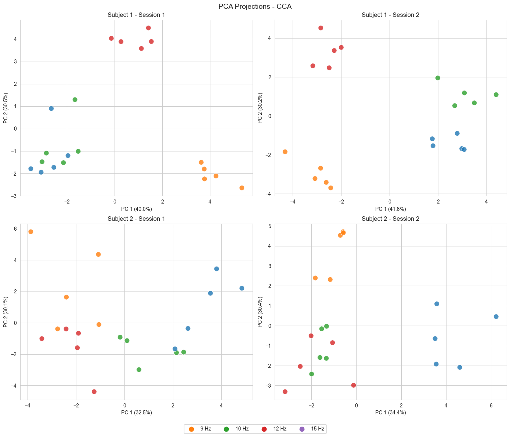
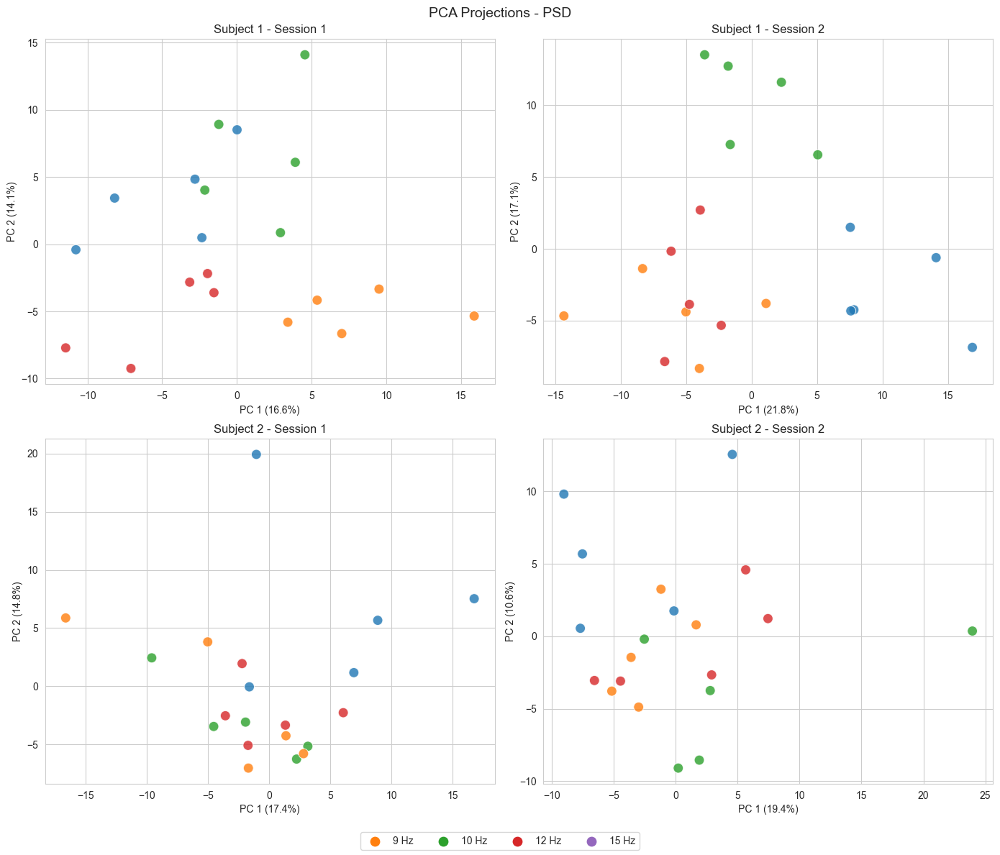
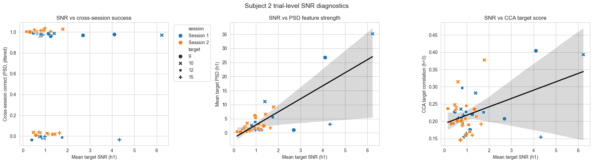
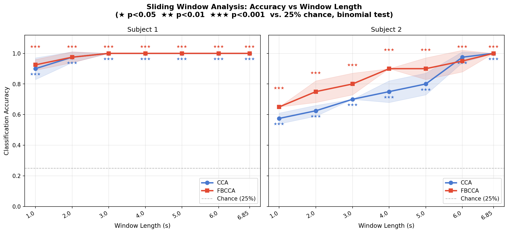
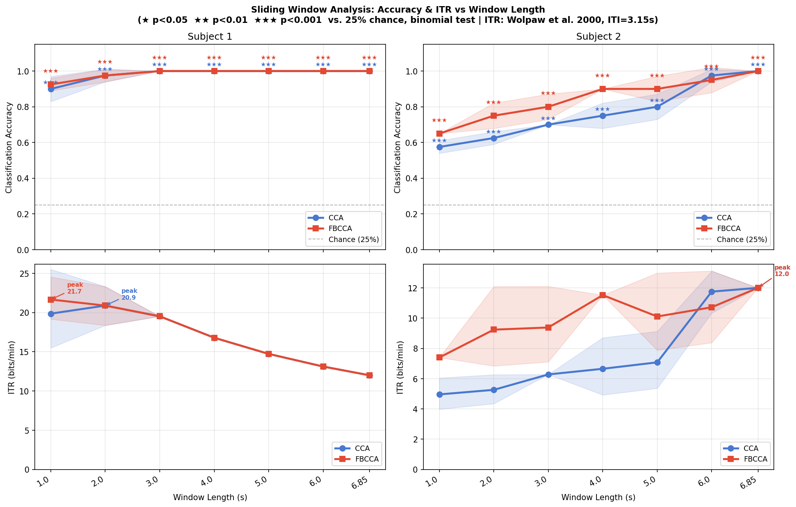

<div align="center">

# 🧠 Brainwave Riders

### *Two brains. Four frequencies. One question: how fast can a mind speak?*

[](https://python.org)
[](https://streamlit.io)
[](https://plotly.com)
[](https://www.br41n.io/)
[](LICENSE)

</div>

---

## The Story

You don't need to move a muscle. You look at a flickering light — 9 Hz, 10 Hz, 12 Hz, or 15 Hz — and your visual cortex locks onto it. That tiny lock is enough for a computer to read your intent.

That's SSVEP. And our question was: **how well, how fast, and for whom?**

We found that the answer is completely different depending on the person — and that's the most interesting thing we discovered.

---

## Results at a Glance

| | Subject 1 | Subject 2 |
|---|:---:|:---:|
| **FBCCA + SVM accuracy** | **100%** | **100%** |
| **Peak ITR** | **21.7 bits/min** | **12.0 bits/min** |
| **Optimal window** | **1 second** | **6.85 seconds** |
| **PSD baseline** | 57% | 35% |
| **eTRCA** | 78% | 20% |
| **Statistical significance** | p < 0.001 ★★★ | p < 0.001 ★★★ |

> **The key insight:** Subject 1 peaks at 1 s with 92.5% accuracy — 21.7 bits/min.
> Subject 2 needs the full 6.85 s to reach 100% — 12.0 bits/min.
> **100% accuracy is not always the optimal target.**

---

## Signal Evidence

<table>
<tr>
<td width="50%">

**PSD per stimulation class**

Clear spectral peaks at target frequencies and harmonics — the raw evidence that SSVEP is happening.



</td>
<td width="50%">

**SNR heatmap across channels**

Subject 1 is purely occipital. Subject 2's response is strongest at PO7/PO8 — which is why a standard 3-channel montage failed them.



</td>
</tr>
<tr>
<td width="50%">

**CCA feature space (PCA projection)**

Four clean clusters — one per stimulus frequency. This is what 100% accuracy looks like geometrically.



</td>
<td width="50%">

**PSD feature space (PCA projection)**

Overlapping blobs. Same data, wrong tool — explains why PSD tops out at 57% for Subject 1 and 35% for Subject 2.



</td>
</tr>
</table>

---

## Pipeline

```
Raw EEG (.mat, MATLAB v5)
         │
         ▼
   Preprocessing
   ├── Bandpass 8–50 Hz (4th-order Butterworth, zero-phase sosfiltfilt)
   ├── No notch filter  ← upper cutoff at 50 Hz already attenuates powerline
   └── No log transform ← bandpass + shrinkage-LDA achieves same stabilisation
         │
         ▼
   Feature Extraction
   ├── PSD   — Welch power at stimulus harmonics (baseline)
   ├── CCA   — sine/cosine reference matching, SVD-based
   └── FBCCA — 5 sub-bands, weighted correlation² (Chen et al. 2015)
         │
         ▼
   LOSO Cross-Validation
   └── Train session A → test session B, both directions averaged
         │
         ▼
   Classification  (SVM + shrinkage-LDA)
         │
         ▼
   Sliding Window Analysis
   └── 7 window sizes (1 s → 6.85 s), step 0.5 s → up to 12× data augmentation
         │
         ▼
   ITR Analysis  (Wolpaw 2000)
   └── B × 60 / (T + ITI)   where ITI = 3.145 s from dataset
```

**Key decisions backed by data:**
- **No MNE dependency in the core pipeline** — pure scipy, fully reproducible
- **SVD-based CCA** (not sklearn) — robust to near-singular matrices at short windows
- **FBCCA over eTRCA** — eTRCA needs ≥15 training trials/frequency; LOSO gives us 5

---

## The BCI-Illiteracy Finding

<table>
<tr>
<td width="55%">

Subject 2 scored 35% with PSD — barely above the 25% chance level. eTRCA collapsed to 20%. FBCCA rescued them to **100%**.

The difference: FBCCA requires **zero training data**. It matches EEG against a mathematical sine/cosine reference. No covariance estimation, no inter-trial statistics, no failure mode when sample sizes are small.

This is the core argument for SNR-robust, training-free methods in clinical BCI deployment — where you cannot always guarantee a clean, stationary, high-trial-count recording.

</td>
<td width="45%">



</td>
</tr>
</table>

---

## Sliding Window × ITR



| Window | Wins/trial | Total samples (20 trials) | Aug. factor |
|---|:---:|:---:|:---:|
| 1.0 s | 12 | 240 | **12×** |
| 3.0 s | 8 | 160 | **8×** |
| 6.85 s | 1 | 20 | 1× |

*Step = 0.5 s. Applied to training data only — test sessions untouched (LOSO integrity preserved).*



---

## Why Not eTRCA?

eTRCA achieves ≥96% on the Nakanishi 2015 benchmark. We tested it. On our dataset: **78% (Subject 1) · 20% (Subject 2)**.

The reason is exact: each frequency gets only **5 training trials under LOSO**. eTRCA's inter-trial covariance matrix `S = (ΣX)(ΣX)ᵀ − ΣXᵢXᵢᵀ` is near-singular at that sample size — the spatial filter it learns is noise. FBCCA doesn't care. Its reference is a sine wave — it always knows what to look for.

---

## Repository Structure

```
brainwave-riders-ssvep/
│
├── src/                          # Validated, importable analysis module
│   ├── _constants.py             # FS, STIM_FREQS, EEG_COLS, CH_NAMES…
│   ├── preprocessing/
│   │   └── preprocess.py         # load_ssvep_data, bandpass_filter, preprocess
│   └── features/
│       └── extraction.py         # extract_psd/cca/fbcca, sliding_windows,
│                                 # windows_to_features, augmentation_stats
│
├── webapp/                       # Streamlit story dashboard
│   ├── app.py                    # 5-tab narrative app
│   └── src/                     # Webapp-specific loaders & Plotly charts
│
├── notebooks/
│   └── explo.ipynb               # Full exploration + eTRCA feasibility test
│
├── results/
│   ├── data.pkl                  # Pre-computed pickle — load instantly, no rerun
│   ├── simulator.html            # Standalone animated FBCCA simulator
│   ├── full_pipeline_results.csv
│   └── sliding_window_results.csv
│
├── docs/                         # Analysis notes in team report style
│   ├── pipeline_notes.md
│   ├── fbcca_analysis.md
│   ├── sliding_window_itr_analysis.md
│   └── channel_selection_analysis.md
│
├── generate_pickle.py            # Recompute results/data.pkl
├── build_simulator.py            # Rebuild results/simulator.html
└── run_sliding_window.py         # Re-run full LOSO sliding window analysis
```

---

## Quick Start

```bash
git clone https://github.com/binivazqua/brainwave-riders-ssvep.git
cd brainwave-riders-ssvep
python -m venv venv && source venv/bin/activate   # Windows: venv\Scripts\activate
pip install -r requirements.txt

# Launch the dashboard (pickle already included — no recompute needed)
streamlit run webapp/app.py
```

```python
# Or use the analysis module directly
from src import load_ssvep_data, preprocess, extract_fbcca, EEG_COLS, STIM_FREQS

df = preprocess(load_ssvep_data("data/raw/ssvep/subject_1_fvep_led_training_1.mat"))
print(extract_fbcca(df, EEG_COLS, STIM_FREQS, win_sec=6.85))
```

> Recompute results after adding new data: `python generate_pickle.py`

---

## Stack

| Layer | Tools |
|---|---|
| EEG loading | `scipy.io.loadmat` (MATLAB v5), `mne` |
| Signal processing | `scipy.signal` — Butterworth, sosfiltfilt, Welch |
| Feature extraction | Custom SVD-based CCA + FBCCA (Chen et al. 2015) |
| Classification | `scikit-learn` — SVM (RBF), shrinkage-LDA |
| Visualisation | `plotly`, `matplotlib`, `seaborn` |
| Dashboard | `streamlit` |
| Data exchange | `pickle` (100 KB, zero recompute on deploy) |

---

## Team

<table>
<tr>
<td align="center" width="50%">

### Bini Vázquez
**Tecnológico de Monterrey**

Signal processing · FBCCA pipeline · CCA / SVD implementation · Sliding window analysis · ITR theory · `src/` module architecture · Streamlit integration · eTRCA feasibility test

*Ran 56 LOSO evaluations across 7 window sizes, 2 methods, 2 subjects and 2 LOSO folds.*

</td>
<td align="center" width="50%">

### Denis Riabkin
**Ilia State University**

Streamlit dashboard · Interactive Plotly visualisation · Story narrative · UX/UI design · Cross-session data pipeline · Webapp architecture

*Built the 5-tab story dashboard that turns 56 numbers into a coherent argument.*

</td>
</tr>
</table>

> **Brainwave Riders** — collaborating remotely across two continents for the **BR41N.IO Spring School Hackathon 2026**.

---

## References

- Müller-Gerking et al. (1999) — SSVEP bandpass preprocessing standard
- Chen et al. (2015) — Filter-Bank CCA with sub-band weights `w_k = (k+1)^-1.25 + 0.25`
- Wolpaw et al. (2000) — Information Transfer Rate: `B × 60 / (T + ITI)`
- Nakanishi et al. (2018) — eTRCA benchmark (12-class, 15 trials/freq)

---

<div align="center">

MIT License · BR41N.IO Spring School 2026 · [github.com/binivazqua/brainwave-riders-ssvep](https://github.com/binivazqua/brainwave-riders-ssvep)

</div>
