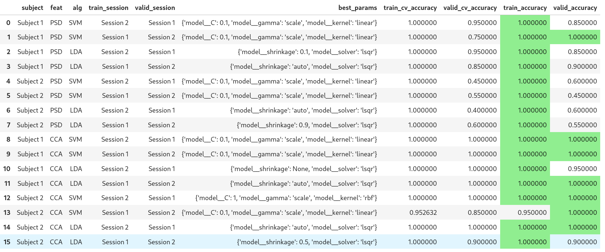

# Debugging Subject Variability Across Models

> We are analyzing a dataset accross 2 subjects. One of them has an important accuracy flow when computing PSD, which makes us sus that theres either a biological or inter session variability.

### Situation:

After creating a solid SSVEP pipeline for the BR41N.IO dataset, in which:

- Raw EEG is bandpass-filtered (8–50 Hz),
- Then two feature extractors are implemented: CCA (canonical correlation against sine/cosine references at 9/10/12/15 Hz, 5 harmonic levels = 20 features) and FBCCA (sub-band weighted version, 4 features).
- PSD-based features.
- Classification uses SVM and LDA with nested cross-validation
  - Outer loop is leave-one-session-out (train on one session, test on the other), inner loop is LOOCV for hyperparameter tuning. 5 trials per (subject, session) are reserved as a truly held-out validation set.



## Insights

### 1. Overfitting model selection

> Seems like GridSearchCV with refit=True picks the hyperparameter set with the best cross-val score, then refits on all training data.

Proposed fix: write a custom model selector that also penalizes the train/test gap instead of purely `valid_cv_accuracy`.

### 2. Missing sliding window

> Currently one fixed 6.85s window per trial.

Proposed fix:
Sliding windows would:
(a) massively increase training samples,
(b) let us test shorter decision windows (relevant for real BCI latency).

Something simple and progressive, like:

```python
def sliding_windows(trial, win_sec, step_sec, fs=256):
    win = int(win_sec * fs)
    step = int(step_sec * fs)
    return [trial[:, s:s+win] for s in range(0, trial.shape[1]-win+1, step)]

```

Try:

> Duration: 1s, 2s, 4s, 6.85s
> Step: 0.25s, 0.5s, 1s

### 3. Outliers

CCA on Subject 1 hits 100% on both session splits.

- That's not inherently wrong for SSVEP (CCA is a near-analytical method for this problem).

Possible flaw origins:

- filtering is global, which is fine.
- CCA features are computed per-trial independently, so there's no leakage there either

Sus:

> The 100% is likely real for this easy subject/feature combo. Subject 2 PSD at 45–60% is the genuinely weak case worth investigating!!!!

## Targeting Overfit with Penalties

Core idea:

```python
def run_nested_cv(
    feat_type,
    feat_sess_1,
    feat_sess_2,
    subject_name,
    algs_and_params,
    gap_lambda: float = 0.5,   # NEW: penalty weight on train-val gap
):

```

And then:

```python
  # refit=False — we'll select params manually below
            grid = GridSearchCV(
                Pipeline(
                    [("scaler", StandardScaler()), ("model", alg_info["alg_class"]())]
                ),
                alg_info["params"],
                cv=LeaveOneOut(),
                scoring="accuracy",
                refit=False,          # CHANGED: don't auto-refit on best_index_
                n_jobs=-1,
                return_train_score=True,
            )
            grid.fit(X_train, y_train)

            # --- NEW: composite selection ---
            cv_results = grid.cv_results_
            train_scores = cv_results["mean_train_score"]
            val_scores   = cv_results["mean_test_score"]
            gap          = train_scores - val_scores
            composite    = val_scores - gap_lambda * gap

            best_idx    = int(np.argmax(composite))
            best_params = cv_results["params"][best_idx]

            # Refit a fresh estimator on the full training session
            # using the composite-selected params
            best_pipe = Pipeline(
                [("scaler", StandardScaler()), ("model", alg_info["alg_class"](**{
                    # strip the "model__" prefix that GridSearchCV adds
                    k.replace("model__", ""): v
                    for k, v in best_params.items()
                }))]
            )
            best_pipe.fit(X_train, y_train)
```

Main Change:

> gap_lambda is now a first-class parameter logged in every result row, so when we compare across runs the dataframe is "self-documenting."

## Using LOOCV across trials together?

From a neuroscientific perspective...

SSVEP signals drift between sessions, due to:

- electrode impedance,
- cap repositioning,
- fatigue
- attention fluctuations

In a nutshell...

> If pool sessions and run LOOCV across all trials together, we'd training on trials from both sessions and testing on held-out trials from both sessions, so the model sees the session-2 distribution during training when it should be blind to it.

Also:

> In a real BCI deployment you calibrate on one session and deploy on the next (or on a new day). The leave-one-session-out protocol directly simulates that.

## Questions and more questions...

The poor PSD performance on Subject 2 is more likely a signal quality or feature issue than a data-quantity issue.

### Sus 1: _Are the PSD features being computed on the right channels?_

Yes, they are.

### Sus 2: _SNR features not strict enough_

Worth tightening that window or switching to a proper SSVEP SNR metric (signal bin / mean of neighboring bins excluding harmonics).

### Sus 3: _sliding windows_

Trying shorter windows with the sliding window approach might actually help PSD more than CCA, since PSD benefits from averaging multiple segments.

## Hands on analysis

Analyzed error graphs initially provided by the database.


Subject 1: _clean_

- Error drops sharply in the first few trials.
- Stabilizes at near-zero error
- All 4 classes converge to clean, flat near-perfect lines
- Explains the 95–100% accuracy in the notebook.


Subject 2 (left) — the problem case:

- Error curves start HIGH, and gradually flatten out but never drop below 5 - 20%
- The curves show much slower learning
- All 4 classes plateau at a noisy, elevated error floor

> This matches exactly what we in the notebook: PSD at 45–60%, and even CCA is weaker than Subject 1

### Computing SNR to find a correlation

Added chunks to Mariami's initial script (everything after last TO DO's).


### Left panel: SNR vs cross-session success

Subject 2 has:

- Low SNR (x-axis ~0.5–2)
- Low cross-session accuracy (y-axis ~0–20%)

Subject 1:
Dots are scattered across the middle-upper region with much higher SNR and accuracy.

    The correlation is crystal clear: low SNR = bad generalization.

Middle panel: SNR vs PSD feature strength

There's a linear relationship:

     — higher SNR → stronger PSD features.

Subject 2's orange dots are bunched at low SNR, so the PSD classifier has weak discriminative features to work with.

This **could be a signal problem.**

Right panel: SNR vs CCA target score

- CCA is less dependent on SNR (see the shallower trend line),
  which explains why CCA works better on Subject 2 than PSD.

- CCA uses template matching across the entire EEG space.
  - it just looks for correlations with sine/cosine references.
  - PSD only cares about relative power at target vs. neighboring bins, so it dies when SNR is low.

## Pseudo Conclusions

Subject 2's weak performance might not be a bug.

Possible reasons/questions:

1. The BCI literature calls these "BCI-illiterate" subjects (~10–20% of population for SSVEP).

2. Can we pre-select trials deliberately?
   If bin Subject 2's 20 trials by SNR and train on only the top-50%, does accuracy jump?

3. Real time discrimination:

   Since CCA is more SNR-robust than PSD, maybe the recommendation is: use CCA for real-time BCIs where signal quality is variable, reserve PSD for high-SNR subjects only.
